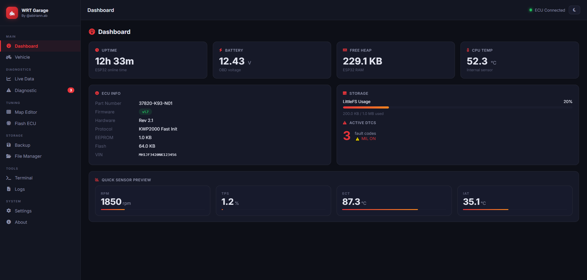

<div align="center">

# 🏍️ WRT Garage

**Alat diagnostik ECU Honda berbasis ESP32 dengan antarmuka web modern**

[](https://github.com)
[](https://www.espressif.com)
[](https://arduino.cc)
[](LICENSE)
[](https://en.wikipedia.org/wiki/K_line_(automotive))

<br/>

> Baca, diagnosa, dan backup ECU Honda langsung dari browser — tanpa laptop, tanpa kabel OBD ke PC.
> Cukup ESP32, optocoupler 4N25, dan koneksi WiFi lokal.

<br/>



</div>

---

## ✨ Fitur Utama

| Kategori | Fitur |
|---|---|
| 🔌 **Koneksi ECU** | Fast Init, 5-Baud Init, Auto Detect, Retry otomatis, CRC validation |
| 📊 **Live Data** | 14 sensor realtime (RPM, TPS, MAP, IAT, ECT, O2, dll) + grafik |
| 🚨 **Diagnostik** | Read DTC, Clear DTC, MIL status, pending fault codes |
| 💾 **Backup** | Baca EEPROM → simpan .bin ke LittleFS + verifikasi checksum |
| 🔄 **Restore** | Simulasi restore — bandingkan file vs ECU tanpa write |
| 🖥️ **Terminal** | Manual K-Line terminal — HEX send/receive + history + export |
| 📋 **Logger** | Session log TX/RX + export CSV/TXT |
| ⚙️ **Settings** | Konfigurasi WiFi, baudrate, auth — tersimpan di flash |
| 🔆 **OTA Update** | Upload firmware baru via browser tanpa cabut USB |
| 🌐 **Web UI** | Single Page App responsive — dark/light mode, glassmorphism |

---

## 🏗️ Arsitektur Sistem

```
┌─────────────────────────────────────────────────────────┐
│                    Browser / HP                         │
│              http://192.168.4.1                         │
└──────────────────────┬──────────────────────────────────┘
                       │ WiFi
┌──────────────────────▼──────────────────────────────────┐
│                    ESP32 DOIT V1                        │
│                                                         │
│  ┌─────────────┐  ┌──────────────┐  ┌───────────────┐  │
│  │  WiFi AP    │  │ Async Web    │  │   LittleFS    │  │
│  │ 192.168.4.1 │  │ Server + WS  │  │ /backup /log  │  │
│  └─────────────┘  └──────────────┘  └───────────────┘  │
│                                                         │
│  ┌─────────────┐  ┌──────────────┐  ┌───────────────┐  │
│  │  REST API   │  │  ECU Manager │  │  K-Line Driver│  │
│  │  /api/...   │  │  Live/DTC/BK │  │  Fast/5Baud   │  │
│  └─────────────┘  └──────────────┘  └──────┬────────┘  │
│                                            │ UART2      │
└────────────────────────────────────────────┼────────────┘
                                             │
                                    ┌────────▼────────┐
                                    │   4N25          │
                                    │  Optocoupler    │
                                    └────────┬────────┘
                                             │
                                    ┌────────▼────────┐
                                    │  Honda K-Line   │
                                    │  OBD Connector  │
                                    └─────────────────┘
```

---

## 🔧 Hardware

### Bill of Materials

| No | Komponen | Spesifikasi | Qty |
|---|---|---|---|
| 1 | ESP32 DOIT DevKit V1 | 240MHz dual-core, WiFi, 4MB Flash | 1 |
| 2 | Optocoupler | 4N25 | 1 |
| 3 | NPN Transistor | BC547 / 2N2222 | 1 |
| 4 | Resistor | 1kΩ, 4.7kΩ, 10kΩ, 20kΩ, 33kΩ, 330Ω | masing-masing 1 |
| 5 | LED | 3mm / 5mm, warna bebas | 1 |
| 6 | Buck Converter | 12V → 5V, min 500mA | 1 |
| 7 | OBD Connector | 4-pin Honda atau OBD2 universal | 1 |
| 8 | Fuse | 1A | 1 |

### Wiring Diagram

```
ESP32 DOIT V1
─────────────────────────────────────────────────────
  GPIO17 (TX) ──[ 1kΩ ]──[ LED IN 4N25 ]── GND
  GPIO16 (RX) ──────────[ Collector 4N25 ]── [ 4.7kΩ Pull-up → 5V ]
                                      │
  GPIO34 (ADC)──[ 33kΩ ]──┬──[ 10kΩ ]──GND     ← Voltage monitor
                           └── GPIO34
  GPIO2  (LED)──[ 330Ω ]──[ LED ]── GND          ← Status indicator
  GND ────────────────────────────────────────── GND
  5V  ────────────────────── Buck Converter Output

4N25 Optocoupler
─────────────────────────────────────────────────────
  Pin 1 (Anode)    ← 1kΩ ← GPIO17 ESP32
  Pin 2 (Cathode)  → GND
  Pin 4 (Emitter)  → GND
  Pin 5 (Collector)→ K-Line (Honda OBD) & GPIO16 RX
  Pin 5 juga       → 4.7kΩ Pull-up → 5V

Voltage Divider RX (5V → 3.3V)
─────────────────────────────────────────────────────
  K-Line ── 10kΩ ──┬── GPIO16 (RX)
                   └── 20kΩ ── GND

Voltage Divider Monitor (+12V → ADC)
─────────────────────────────────────────────────────
  OBD +12V ── 33kΩ ──┬── GPIO34
                      └── 10kΩ ── GND
```

---

## 📁 Struktur Project

```
remap/
│
├── 📄 README.md
├── 📄 TUTORIAL_UPLOAD.md          ← Tutorial lengkap Arduino IDE
├── 📄 platformio.ini              ← Config PlatformIO
│
├── 🗂️ firmware/                   ← Source C++ ESP32
│   ├── main.cpp                   ← Entry point, setup/loop
│   ├── kline.cpp / .h             ← K-Line driver (ISO 9141)
│   ├── ecu.cpp / .h               ← ECU manager (PIDs, DTC, backup)
│   ├── wifi.cpp / .h              ← WiFi Access Point + mDNS
│   ├── webserver.cpp / .h         ← Async HTTP + WebSocket
│   ├── api.cpp / .h               ← REST API handler
│   ├── logger.cpp / .h            ← Session logger
│   ├── backup.cpp / .h            ← EEPROM backup utility
│   ├── filesystem.cpp / .h        ← LittleFS abstraction
│   ├── ota.cpp / .h               ← OTA firmware update
│   ├── settings.cpp / .h          ← Persistent config
│   ├── utils.cpp / .h             ← Helper functions
│   ├── config.cpp
│   └── include/                   ← Semua header file (.h)
│
├── 🌐 web/                        ← Frontend web (di-flash ke LittleFS)
│   ├── index.html                 ← Single Page Application
│   ├── css/main.css               ← Dark/light theme, responsive
│   └── js/
│       ├── api.js                 ← REST client + WebSocket
│       ├── dashboard.js           ← App shell + navigasi
│       ├── live.js                ← Realtime data + Chart.js
│       ├── dtc.js                 ← Diagnostic UI
│       ├── backup.js              ← Backup/restore UI
│       ├── terminal.js            ← K-Line terminal
│       └── settings.js            ← Settings + OTA UI
│
├── 🗃️ data/                       ← LittleFS data direktori
│   ├── backup/                    ← File .bin backup ECU
│   ├── log/                       ← Session log files
│   ├── config/                    ← settings.json
│   └── temp/
│
├── 🗂️ HondaECUTool/               ← Arduino IDE project folder
│   └── HondaECUTool.ino
│
└── 🐍 scripts/
    └── copy_web.py                ← Auto-copy web → data/web/
```

---

## 🚀 Quick Start

### Prerequisites

- Arduino IDE 2.3.x atau PlatformIO
- ESP32 Arduino Core 3.x
- Library: `ESPAsyncWebServer`, `AsyncTCP`, `ArduinoJson 7.x`
- Plugin: ESP32 LittleFS Uploader

> 📖 Tutorial lengkap ada di **[TUTORIAL_UPLOAD.md](TUTORIAL_UPLOAD.md)**

### Upload via Arduino IDE

```bash
# 1. Buka HondaECUTool/HondaECUTool.ino di Arduino IDE
# 2. Copy semua file .cpp + folder include/ ke HondaECUTool/
# 3. Copy web/ → HondaECUTool/data/web/
# 4. Set Board: ESP32 Dev Module
# 5. Upload firmware
Ctrl + U

# 6. Upload web files ke LittleFS
Tools → ESP32 LittleFS Data Upload
```

### Upload via PlatformIO

```bash
# Clone project
git clone https://github.com/YOUR_USERNAME/honda-ecu-tool.git
cd honda-ecu-tool

# Upload firmware
pio run --target upload

# Upload LittleFS (web files)
pio run --target uploadfs
```

### Koneksi

```
1. Sambungkan ESP32 ke power / komputer
2. Buka WiFi settings di HP/laptop
3. Connect ke: "Honda ECU Tool"  password: 12345678
4. Buka browser → http://192.168.4.1
```

---

## 🌐 REST API

### GET Endpoints

| Endpoint | Deskripsi |
|---|---|
| `GET /api/status` | Status ESP32 — heap, uptime, battery, ECU state |
| `GET /api/info` | Informasi ECU (part number, firmware, dll) |
| `GET /api/live` | Snapshot data sensor terkini |
| `GET /api/dtc` | Daftar DTC yang tersimpan |
| `GET /api/log?count=50` | Session log entries |
| `GET /api/files?path=/backup` | List file di direktori LittleFS |
| `GET /api/settings` | Konfigurasi saat ini |
| `GET /api/log/export` | Download log sebagai CSV |

### POST Endpoints

| Endpoint | Deskripsi |
|---|---|
| `POST /api/connect` | Inisiasi koneksi ECU via K-Line |
| `POST /api/disconnect` | Tutup sesi ECU |
| `POST /api/read-id` | Baca identifikasi ECU |
| `POST /api/read-dtc` | Scan DTC dari ECU |
| `POST /api/clear-dtc` | Hapus semua DTC `🔒 auth` |
| `POST /api/backup` | Mulai backup EEPROM `🔒 auth` |
| `POST /api/restore` | Simulasi restore `🔒 auth` |
| `POST /api/start-log` | Mulai logging ke file |
| `POST /api/stop-log` | Stop logging |
| `POST /api/settings` | Update konfigurasi `🔒 auth` |
| `POST /api/kline-send` | Kirim raw HEX ke K-Line |
| `POST /api/set-model` | Set model kendaraan Honda |
| `POST /api/reboot` | Reboot ESP32 `🔒 auth` |
| `POST /api/ota` | Upload firmware baru `🔒 auth` |

### DELETE Endpoints

| Endpoint | Deskripsi |
|---|---|
| `DELETE /api/backup?filename=x` | Hapus file backup `🔒 auth` |

### WebSocket `/ws`

```json
// Subscribe: kirim dari client
{ "cmd": "ping" }
{ "cmd": "status" }
{ "cmd": "live" }
{ "cmd": "log" }

// Server broadcast setiap 100ms (saat ECU connected)
{
  "type": "live",
  "data": {
    "rpm": 1450, "tps": 12.5, "ect": 87.3,
    "iat": 35.1, "map": 34.0, "battVoltage": 12.4,
    "injPW": 2.145, "ignTiming": 15.0, "speed": 0,
    "o2": 450.0, "closedLoop": true, "fuelTrim": -2.3
  },
  "vbat": 12.43,
  "heap": 234560,
  "uptime": 45231
}
```

---

## 📟 Live Data — Sensor yang Didukung

| PID | Sensor | Unit | Keterangan |
|---|---|---|---|
| 0x01 | RPM | rpm | Engine speed |
| 0x02 | TPS | % | Throttle position |
| 0x03 | MAP | kPa | Manifold pressure |
| 0x04 | IAT | °C | Intake air temperature |
| 0x05 | ECT | °C | Engine coolant temperature |
| 0x06 | Battery Voltage | V | Tegangan aki |
| 0x07 | Injector PW | ms | Lebar pulsa injeksi |
| 0x08 | Ignition Timing | ° | Sudut pengapian |
| 0x09 | Vehicle Speed | km/h | Kecepatan kendaraan |
| 0x0A | Engine Load | % | Beban mesin |
| 0x0B | Idle Switch | ON/OFF | Status idle |
| 0x0C | O2 Sensor | mV | Sensor oksigen |
| 0x0D | Fuel Trim | % | Koreksi bahan bakar |
| — | Closed/Open Loop | — | Status fuel control |

---

## 🏍️ Kendaraan yang Didukung

| Model | K-Line |
|---|---|
| Honda Beat | ✅ |
| Honda Scoopy | ✅ |
| Honda Genio | ✅ |
| Honda Vario (110/125/150/160) | ✅ |
| Honda PCX 150/160 | ✅ |
| Honda ADV 150/160 | ✅ |
| Honda Supra GTR/X | ✅ |
| Honda Sonic 150R | ✅ |
| Honda Verza 150 | ✅ |
| Honda CB150R | ✅ |
| Honda CBR150R | ✅ |
| Honda CRF150L | ✅ |
| Honda Stylo 160 | ✅ |
| Honda EM1 e: | ✅ |

> ⚠️ Kompatibilitas bergantung pada versi ECU masing-masing unit. Selalu tes koneksi dahulu sebelum operasi backup.

---

## ⚙️ Konfigurasi Pin

| GPIO | Fungsi | Keterangan |
|---|---|---|
| `GPIO 16` | K-Line RX | Serial2 RX, via voltage divider 5V→3.3V |
| `GPIO 17` | K-Line TX | Serial2 TX, via 4N25 optocoupler |
| `GPIO 34` | Voltage Monitor | ADC input, via voltage divider |
| `GPIO 2` | Status LED | Built-in LED |

---

## 🔐 Keamanan

- Endpoint destruktif (clear DTC, backup, reboot, OTA) dilindungi HTTP Basic Auth
- Credentials default: `admin` / `admin123` — **segera ganti setelah pertama kali setup**
- Password tidak pernah dikirim balik via API (ditampilkan sebagai `"********"`)
- Session timeout: 30 menit

**Ganti credentials via Settings → Authentication** atau edit `firmware/include/config.h`:
```cpp
#define AUTH_USERNAME  "username_kamu"
#define AUTH_PASSWORD  "password_kuat"
```

---

## 🛠️ Development

### Build dengan PlatformIO

```bash
# Install PlatformIO
pip install platformio

# Install dependencies
pio pkg install

# Build
pio run

# Upload firmware
pio run -t upload

# Upload LittleFS
pio run -t uploadfs

# Monitor serial
pio device monitor
```

### Serial Debug Output

```
=== Honda ECU Tool v1.0.0 ===
[  INF][Main] Booting...
[  INF][FS  ] LittleFS mounted OK
[  INF][WiFi] AP started: SSID=Honda ECU Tool IP=192.168.4.1
[  INF][WiFi] mDNS: http://honda-ecu.local
[  INF][WbSv] Server started on port 80
[  INF][Main] Boot complete. IP: 192.168.4.1
[  INF][Main] Free heap: 254032 bytes
[  INF][KLin] UART init TX=17 RX=16 baud=10400
[  INF][ECU ] Connecting...
[  INF][KLin] Fast Init OK
[  INF][ECU ] Session started OK
[  INF][ECU ] ID: 37820-K93-N01 FW: 1.7
```

### Modifikasi K-Line Protocol

Driver K-Line ada di `firmware/kline.cpp`. Untuk menambah protocol baru:

```cpp
// Di kline.h, tambahkan enum
enum KLineInitMode {
    KLINE_FAST_INIT,
    KLINE_5BAUD_INIT,
    KLINE_AUTO_DETECT,
    KLINE_YOUR_CUSTOM  // ← tambahkan di sini
};

// Di kline.cpp, implementasi
KLineResult KLineDriver::_yourCustomInit() {
    // implementasi kamu
}
```

---

## 🗺️ Roadmap

- [x] K-Line Fast Init & 5-Baud Init
- [x] Live data 14 PIDs
- [x] DTC Read & Clear
- [x] EEPROM Backup & Verify
- [x] Restore Simulation
- [x] WebSocket realtime
- [x] OTA Firmware Update
- [x] Session Logger CSV
- [x] K-Line Terminal
- [x] Dark/Light Mode
- [ ] Multi ECU Auto Detection
- [ ] Bluetooth BLE support
- [ ] SD Card logging
- [ ] PWA (Progressive Web App)
- [ ] CAN Bus expansion
- [ ] MQTT telemetry
- [ ] Freeze Frame data
- [ ] Fuel map visualization

---

## 🤝 Kontribusi

Pull request sangat disambut! Untuk perubahan besar, buka issue terlebih dahulu.

1. Fork repository ini
2. Buat branch fitur: `git checkout -b feature/fitur-kamu`
3. Commit: `git commit -m 'feat: tambah fitur kamu'`
4. Push: `git push origin feature/fitur-kamu`
5. Buka Pull Request

### Commit Convention

```
feat:     Fitur baru
fix:      Bug fix
docs:     Update dokumentasi
refactor: Refactoring kode
test:     Tambah test
chore:    Maintenance
```

---

## ⚠️ Disclaimer

> Alat ini dibuat **untuk tujuan diagnostik dan edukasi**.
>
> - Jangan gunakan untuk memodifikasi data ECU kendaraan produksi
> - Selalu backup sebelum melakukan operasi apapun
> - Penulis tidak bertanggung jawab atas kerusakan akibat penggunaan alat ini
> - Pastikan tegangan dan polaritas koneksi benar sebelum menyalakan

---

## 📜 License

```
MIT License — bebas digunakan, dimodifikasi, dan didistribusikan
dengan tetap mencantumkan kredit.
```

---

## 🔗 Referensi

- [ISO 9141-2 K-Line Protocol](https://en.wikipedia.org/wiki/K_line_(automotive))
- [KWP2000 / ISO 14230](https://en.wikipedia.org/wiki/Keyword_Protocol_2000)
- [ESP32 Arduino Core](https://github.com/espressif/arduino-esp32)
- [ESPAsyncWebServer](https://github.com/me-no-dev/ESPAsyncWebServer)
- [ArduinoJson](https://arduinojson.org)
- [LittleFS ESP32](https://github.com/lorol/LITTLEFS)

---

<div align="center">

**Honda ECU K-Line Diagnostic Tool** — dibuat dengan ❤️ untuk komunitas otomotif Indonesia

⭐ Jika project ini membantu, jangan lupa kasih star di GitHub!

</div>
